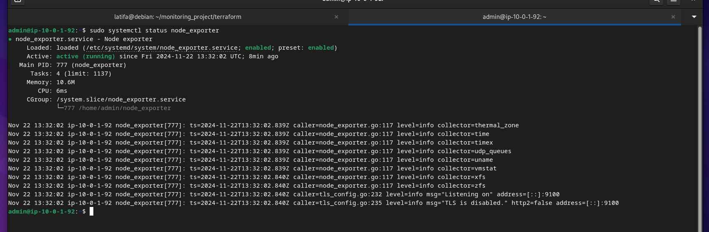
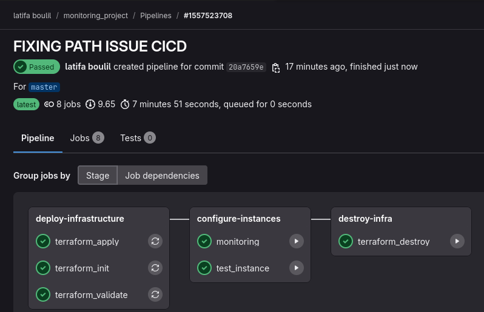
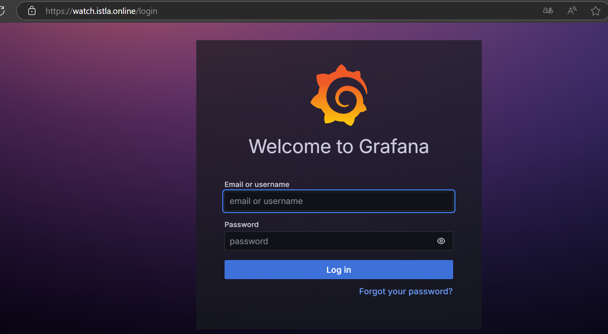

# Cloud Monitoring Setup with Terraform, Ansible, Prometheus, and Grafana

## 1. Introduction

This project explains how to automate the setup of cloud infrastructure for monitoring EC2 instances. It uses tools like Terraform and Ansible to create and configure the infrastructure, while Prometheus and Grafana handle metric collection and visualization. The setup includes SSL to ensure secure data transfer. This project provides a practical way to learn how to build a simple, secure, and effective monitoring system using widely used tools.

## 2. Prerequisites

Before starting, ensure you have the following:

- AWS Account: An active AWS account with the necessary credentials for deploying and managing resources.
- Terraform & Ansible: Installed and configured on your local machine to automate infrastructure provisioning and configuration management.
- GitLab Repository: A GitLab repository set up for managing the project’s code and CI/CD pipeline.
- Domain Name: A registered domain name for managing DNS and SSL certificate generation.

## 3. Project Architecture


The project follows a modular architecture, organized into several key components to streamline infrastructure management, automation, and deployment.

```
monitoring_project/
├── .gitignore                   
├── .gitlab-ci.yml                
├── ansible/                     
│   ├── files/                   
│   │   ├── index.html           # Static HTML file for web interface
│   │   ├── nginx_monitoring_proxy.j2  
│   │   └── nginx_proxy.j2       
│   ├── scripts/                 
│   └── playbooks/
│   │   ├── ....            
├── assets/                      
│   ├── ...              # Collection of images and screenshots for the project
├── terraform/                   
│   ├── security/                
│   │   ├── ...           
│   ├── vpc/                     
│   │   ├── ...          
│   ├── web/                     
│   │   ├── ...      
│   ├── main.tf                  
│   ├── provider.tf              
│   └── variables.tf      

```
Key Components:

- GitLab CI/CD: The .gitlab-ci.yml file automates the deployment pipeline for the entire project, handling tasks like infrastructure provisioning and application deployment.

- Ansible: Located in the ansible/ directory, Ansible playbooks and scripts automate the setup of EC2 instances, system updates, and the installation of monitoring tools like Prometheus and Grafana. Additionally, Jinja2 templates (such as nginx_monitoring_proxy.j2 and nginx_proxy.j2) are used to dynamically generate Nginx configuration files.


- Assets: The assets/ folder stores images and screenshots used throughout the project, likely for documentation or web content.

- Terraform: In the terraform/  directory holds the infrastructure-as-code configuration in various modules. The modules define resources like VPCs, security groups, and EC2 instances, enabling easy management and scaling of the infrastructure.

## 4. Infrastructure Setup with Terraform

The infrastructure for this project is fully managed and provisioned using Terraform, ensuring a consistent, repeatable deployment process. Below is an overview of the key components configured in the infrastructure:

1. VPC Creation: A Virtual Private Cloud (VPC) is created to provide a secure and isolated network environment for our resources. This VPC allows for the segmentation of the infrastructure into different subnets, ensuring proper routing and security.

2. Subnets: Two subnets are provisioned within the VPC:
    One public subnet for the test instance, which is publicly accessible.
    One private subnet for the monitoring instance, which is kept private for security reasons.

3. Internet Gateway: An internet gateway is created and attached to the VPC, enabling internet connectivity for resources within the public subnet.

4. Route Tables: Two separate route tables are created: One for each subnet configured to allow internet access 

5. Instances: Two EC2 instances are provisioned:
    A test_instance, which will be monitored using Prometheus and Grafana.
    A monitoring instance, which will be responsible for monitoring the test instance and managing Prometheus and Grafana.

6. Ansible Hosts File: To ensure the seamless configuration of the instances, an Ansible hosts file is generated dynamically. This is done using a null resource in Terraform, which creates the inventory file containing the necessary information to manage the instances with Ansible. This step is crucial for setting up the monitoring tools and automating system configuration.


7. Security Module: A strict security configuration is applied to the infrastructure using the security module. This includes defining security groups, which will be detailed later in the project.


## 5. Configuration Management with Ansible

Ansible is used to automate the configuration of both the test_instance and monitor_instance. The setup consists of three playbooks:

1. Configure Test Instance (test_instance.yml)
This playbook is used to configure the test_instance, performing the following tasks:
    * Deploy a static HTML file: The playbook uploads and sets up the static HTML page on the server.
    * Install and configure Nginx: Nginx is installed and set to serve the static HTML file.
    * Install SSL certificate: The playbook configures SSL to enable HTTPS for secure communication.

2. Install Node Exporter (install_node_exporter.yml)
This playbook installs Node Exporter on the test_instance to collect and expose system metrics, which are later scraped by Prometheus for monitoring purposes.

3. Configure Monitor Instance (monitoring.yml)
The third playbook configures the monitor_instance with the following steps:

    * Install Prometheus and Grafana: Prometheus is set up to scrape metrics, and Grafana is installed to visualize the data.
    * Dynamically configure the IP of the test_instance: The playbook retrieves the dynamically assigned IP of the test_instance using Ansible's inventory and configures Prometheus to scrape the metrics.
    * Install and configure Nginx as a reverse proxy: Nginx is set up on the monitor_instance to proxy traffic and serve Grafana dashboards securely with SSL.
    * Jinja2 templates are used to dynamically generate the Nginx configuration for reverse proxying.

These playbooks ensure that both instances are properly configured, monitored, and secured, providing a fully automated environment for monitoring and data collection.

## 6. Monitoring Setup 

The monitoring setup is integrated into the project using Prometheus and Grafana, both of which were installed and configured automatically via Ansible.

Prometheus collects system metrics from the test_instance using Node Exporter. The dynamic retrieval of the test instance’s IP ensures Prometheus is always scraping the correct metrics.

Grafana is used to visualize the data collected by Prometheus. Dashboards are configured to display real-time system performance, making it easy to monitor the health of the infrastructure.

Nginx is set up as a reverse proxy for both Prometheus and Grafana, with SSL certificates to secure the communication.

This setup provides a robust monitoring solution, allowing for ongoing tracking of system health and performance, while ensuring secure and accessible visualizations through Grafana.





## 7. CI/CD Workflow

The GitLab CI/CD pipeline automates the entire process of deploying infrastructure and configuring instances. By integrating Terraform for infrastructure provisioning and Ansible for instance configuration, the pipeline ensures fast, consistent, and repeatable deployments. This automation reduces manual effort, minimizes errors, and speeds up updates. Additionally, sensitive information is securely managed in GitLab CI/CD variables, ensuring that sensitive data is never exposed in the codebase.




## 8. Security

1. Security Groups

The infrastructure uses strict security groups to ensure that only necessary communication is allowed between resources. Specifically:

- Port 443 is open to the public, enabling secure HTTPS access to the application.
- Port 80 is temporarily open for SSL certificate installation but is closed immediately after the certificate is applied.
- All other open ports are either:
    * Restricted to specific security groups, ensuring that only required instances (such as the monitoring instance) can communicate with each other.
    * Limited to trusted IP addresses or personal IP address ranges to further secure the environment from unwanted external access.

This approach ensures minimal exposure and follows the principle of least privilege, reducing the risk of unauthorized access.

2. HTTPS (SSL/TLS)
To ensure secure communication between clients and the application, all web traffic is served over HTTPS using SSL/TLS certificates. The certificates are installed on the EC2 instances and configured via Ansible to encrypt data during transmission.

The monitoring web interface, as well as the test instance, both rely on secure HTTPS connections, ensuring data privacy and integrity.




3. Environment Variables and Sensitive Information
Sensitive information such as AWS credentials, the monitoring domain name, and other application secrets are never hard-coded in the infrastructure code or playbooks. Instead:

All sensitive data is securely stored as GitLab CI/CD variables, ensuring it is kept out of version control and is only available during deployment.
These variables include details such as the monitoring domain name, AWS credentials, and any other sensitive configuration values. By using environment variables in GitLab, we ensure that this information is not exposed in the codebase or in the project repository.
This method ensures that sensitive information is kept secure and is only accessible by authorized personnel or systems, preventing unauthorized access.


## 9. Troubleshooting

* Issue
During the setup, Prometheus was unable to scrape metrics from Node Exporter on the test_instance, even though the security groups were configured correctly.

* Cause
Scraping metrics via the public IP was unreliable due to network latency, routing issues, and potential firewall restrictions between instances in different subnets. The private IP provided a more stable and direct connection within the same VPC

* Solution
To resolve the issue, I switched to using the private IP for communication between the instances. As the private IP was unknown initially, we leveraged Ansible’s gather_facts module to dynamically retrieve it. After obtaining the private IP, we updated the Prometheus configuration file to scrape metrics from it, which successfully resolved the problem.


## 10. Manual Steps

- Update IP for OVH Domain Name: After the EC2 instances are deployed, the IP addresses need to be manually updated in the OVH DNS settings. This ensures that the domain name correctly resolves to the new instance IPs.

- Create a Grafana Alert for Monitoring: While the setup of Prometheus and Grafana is automated, the creation of specific Grafana monitoring alerts has be done manually. Ideally this part could be automated. 


## 11. Cost Considerations 

- Free Tier Resources: We have primarily used AWS Free Tier resources, specifically EC2 instances, for this project. This allows for low-cost (or no-cost) deployment during development and testing.

- DNS Cost: The DNS service is provided by OVH, and the only recurring cost is for the DNS management. This cost is minimal but should be considered when deploying the project.

- Variable Costs: While the infrastructure relies mostly on Free Tier services, costs may increase depending on:

    * Instance Type: If you choose a higher instance type or more powerful EC2 instances than those provided by the Free Tier, this will increase the cost.
    * Additional Resources: Adding more EC2 instances or scaling your infrastructure will incur additional charges.
    * Scaling Considerations: If you decide to scale your infrastructure or make use of higher-end resources, costs will grow based on the type and number of EC2 instances used.

